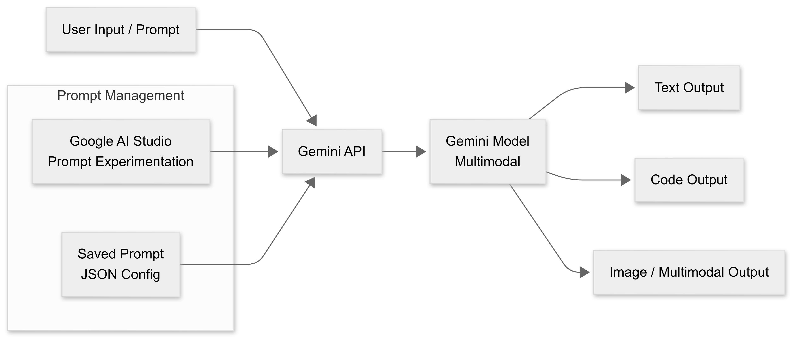
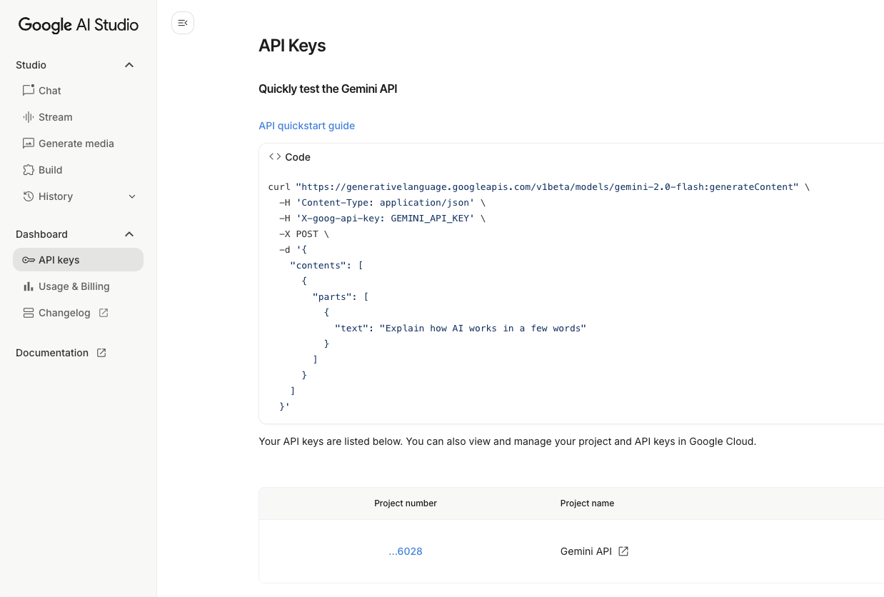
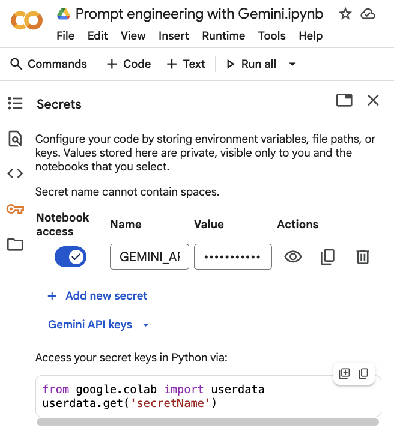
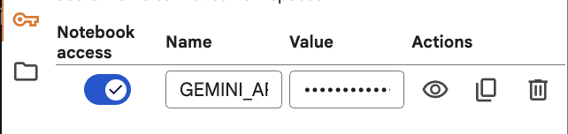
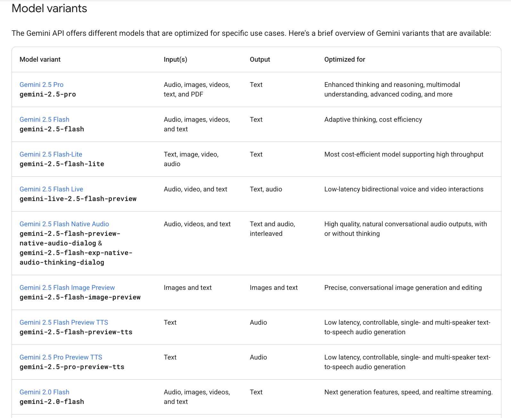
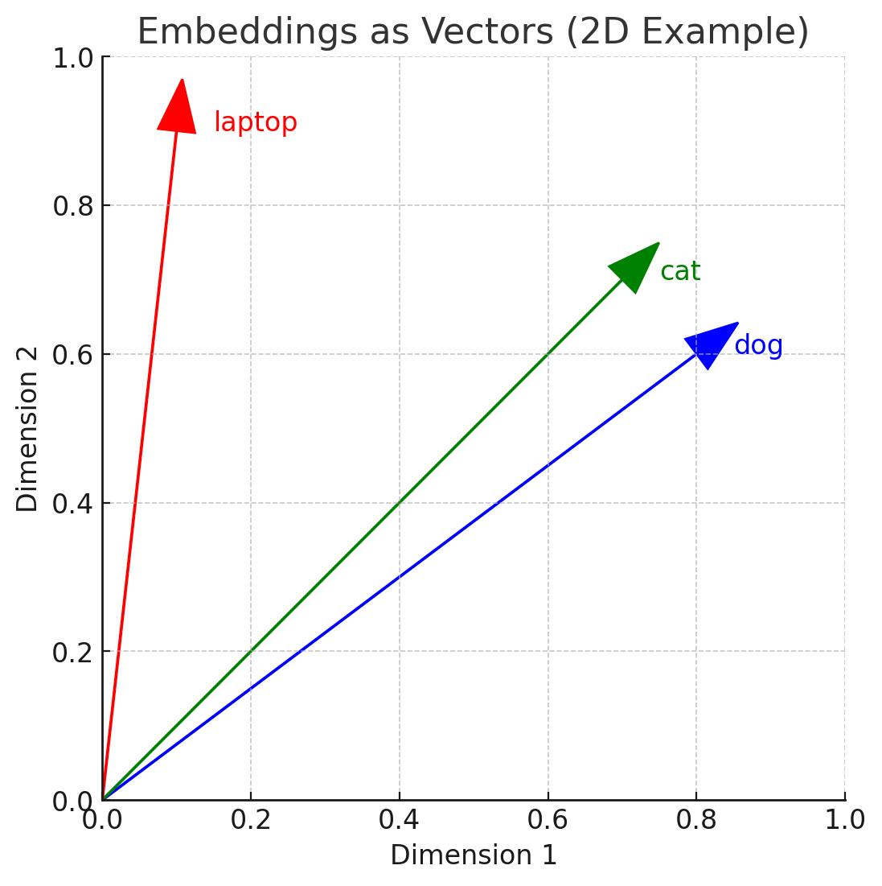

# Using Gemini via API in Google Colab

The **Gemini API** is an interface provided by Google that allows developers to integrate **Gemini** into their own applications, websites, and scripts.

### What is API?

*   **API** stands for Application Programming Interface. It's a set of rules and tools that allows different software applications to communicate with each other.

API lets you send a "prompt" (which could be text, an image, or both) to the Gemini model and receive a generated response back in your code. Same as you saw in the interactive prompting section, but now you can do it programmatically and get the output directly in your application, script, database, file, etc.



>*Note 1*: These days every LLM provider offers an API, including OpenAI (GPT-4, GPT-3.5), Anthropic (Claude), Cohere, and others. The concepts are similar across providers, but the exact code and parameters will differ. However, LLM providers make effort to keep the APIs as similar as possible to reduce friction for developers. 

>*Note 2*: LLL providers try to make their APIs as user-friendly as possible. This tutorial will provide a basic overview, but for more details, refer to the official documentation: [Google Generative AI API docs](https://ai.google.dev/generative-ai/docs/).

>*Note 3*: APIs can change over time. Always check the latest documentation for updates! It is the API documentation that is **the source of truth**.


#### Use Cases for Interactive Prompting vs API Prompting

Example using Gemini for research:

- Use Gemini in Google AI Studio (**interactive prompting**) when you are:

* **Exploring hypotheses** → “How does the model react if I phrase it this way?”
* **Testing strategies** → zero-shot vs few-shot vs chain-of-thought.
* **Designing evaluation criteria** → you need to see a range of outputs before deciding what counts as “good.”
* **Doing qualitative analysis** → e.g. testing model reasoning, biases, creativity.
* **Running small-scale experiments** → interactive environment is faster than coding when your dataset is tiny (1–20 examples).

- Use **Gemini API** when you are:

* **Scaling experiments** → apply a fixed prompt across 100s/1000s of test cases.
* **Quantitative evaluation** → collect outputs systematically, score them, run statistical analysis.
* **Reproducibility** → lock in a specific prompt + config, so results can be rerun exactly.
* **Integration with research pipelines** → connect model outputs to Python notebooks, R, or data analysis tools.
* **Benchmarking** → run the same API setup across multiple tasks/models.

---
**Side-by-Side** 

| AI Studio (Interactive Prompting)         | Gemini API                                       |
| ----------------------------------------- | ------------------------------------------------ |
| Quick experiments, qualitative insights   | Large-scale experiments, quantitative analysis   |
| Great for *trying prompt variations* live | Great for *locking in and running fixed prompts* |
| No coding required                        | Requires coding (Python, REST, SDKs)             |
| Ideal for exploratory research            | Ideal for reproducibility & benchmarking         |
| Fast feedback loop                        | Automation & integration into pipelines          |

---

### Setup

Google Colab is a perfect environment to experiment with the Gemini API because it's a free, cloud-based Jupyter notebook that runs on Google's servers.

Here is a step-by-step guide:

#### Step 1: Get an API Key
You need a key to authenticate your requests.
1.  Go to [Google AI Studio](https://aistudio.google.com/).
2.  Sign in with your Google account.
3.  Click "Get API key" and then "Create API key".

4.  Copy the generated key. **Keep this secret!** Do not share it or check it into public code repositories.

#### Step 2: Set Up Your Colab Notebook
1.  Open a new notebook: [Google Colab](https://colab.research.google.com/).

2. Go to "Secrets" (key icon on the left sidebar) and add a new secret named `GEMINI_API_KEY` with the value being your copied API key.



Make sure that the secret is activated and available in your notebook environment.



3.  Install the Google Generative AI Python library. Run this code in a cell:
    ```python
    !pip install -q -U google-generativeai
    ```
    (The `-q` flag makes the installation quiet and less verbose).
    
4. Configure the API key in your notebook:
    ```python
    import google.generativeai as genai
    from google.colab import userdata

    api_key = userdata.get('GEMINI_API_KEY')
    genai.configure(api_key=api_key)
    ```

 5. Verify the setup by listing available models:
```python
import google.generativeai as genai
from google.colab import userdata

# Fetch your API key
GEMINI_API_KEY = userdata.get('GEMINI_API_KEY')
genai.configure(api_key=GEMINI_API_KEY)

# List available models
for model in genai.list_models():
    print(model.name, model.supported_generation_methods)
```

>*Note*: there are several ways to supply your API key. The above method uses Colab's built-in secrets manager, which is secure and convenient. Alternatively, you can hard-code it (not recommended for security reasons) or use environment variables.

#### Step 3: Write the Code to Use the API
Here's a basic example to get you started with text generation.

```python
from google import genai
from google.colab import userdata

# Fetch your secret into a variable
GEMINI_API_KEY = userdata.get('GEMINI_API_KEY')

# Pass it into the client
client = genai.Client(api_key=GEMINI_API_KEY)

# check that the model version is available at https://ai.google.dev/gemini-api/docs/models
response = client.models.generate_content(
    model="gemini-2.5-flash",
    contents="What is masstige buying behavior?"
)

print(response.text)
```

The **official API documentation** is always the best source of truth for Gemini. It contains up-to-date details on:

* Which models are currently available,
* What functionality each model supports (e.g., text, multimodal, embeddings), and
* The pricing structure for different models and usage tiers.

Always begin by checking the docs before you code: [Gemini API Documentation](https://ai.google.dev/gemini-api/docs/).

>*Note**: Newer, larger Gemini models (e.g., `models/gemini-2.5-pro`) generally deliver the highest quality results — but they also come with higher costs. For many tasks, a **lighter and cheaper model** is sufficient.

Examples where a smaller/cheaper model is usually enough:**

* **Keyword extraction**: Pulling main topics from an article.
* **Simple summarization**: Creating a short abstract of a straightforward text.
* **Text classification**: Tagging emails as “spam” or “not spam.”
* **Data formatting**: Converting JSON to CSV, or rephrasing a sentence into bullet points.

**Examples where a more advanced (and expensive) model is worth it:**

* **Multimodal reasoning**: Analyzing an image with a related text query.
* **Complex research summaries**: Synthesizing multiple documents into a structured executive briefing.
* **Creative generation**: Producing nuanced copy in a specific brand voice.
* **Code understanding and generation**: Debugging or generating production-quality code snippets.

---

**Rule of thumb:** Start with a lighter model if your task is simple and deterministic. Move up to a more advanced model only when you need reasoning depth, multimodal inputs, or creativity.



Model variants show the type of data the model can work and the type of output it can generate

### Embeddings

Large language models (LLMs) are trained on massive amounts of text and optimized to capture the structure and meaning of language. A core by-product of this training is embeddings: numerical vector representations of words, sentences, or documents.

They are “core” because everything an LLM does—reasoning, matching context, predicting next tokens—relies on mapping text into a semantic space.

Without embeddings, the model can’t compare meaning, detect similarity, or transfer knowledge between contexts.

**Choosing the right embedding model** is critical:

- **Task alignment**: Embeddings optimized for search will capture semantic closeness differently than embeddings tuned for classification.

- **Model size vs cost**: Large, general-purpose embeddings may be overkill for lightweight similarity tasks. Smaller models often deliver comparable performance at a fraction of the cost.

- **Practicality**: Expensive embeddings increase API costs and latency. If your use case is simple (e.g., clustering FAQ answers), a smaller or open-source model is often enough.

**When a Big Model Is Overkill**

For example:

- **Simple keyword clustering**: You don’t need a state-of-the-art embedding model—smaller Hugging Face options or open models work.

- **FAQ search / tagging**: Moderate embeddings suffice. A huge LLM-based embedding may cost more without giving noticeable accuracy gains.

- **Prototyping**: Start cheap, scale up only if the accuracy gap matters for your use case.

**Alternatives to Expensive Models**

**Hugging Face models** – Examples:

- `sentence-transformers/all-MiniLM-L6-v2` → lightweight, great for semantic similarity.

- `intfloat/multilingual-e5-small` → multilingual embeddings for search and clustering.

- **Smaller API models** – Many providers offer “lite” or “small” embedding models that are much cheaper and often good enough.

- **Hybrid approaches** – Use a smaller embedding model for first-pass similarity, and only call a large LLM if you need deeper reasoning.

Model variants for embeddings are available  https://ai.google.dev/gemini-api/docs/embeddings#model-versions

>*Note*: while Gemini is multimodal currently only text embeddings are supported.

You can use embeddings for a wide **range of tasks** from classification to document search. Specifying the right task type helps optimize the embeddings for the intended relationships, maximizing accuracy and efficiency.

Supported task types: https://ai.google.dev/gemini-api/docs/embeddings#supported-task-types

### Embeddings and Cosine Similarity

When you use embeddings, you’re representing text (words, sentences, documents) as **vectors** in a high-dimensional space. The meaning of the text is encoded in the *direction* of the vector.

For example:
* “dog” → `[0.8, 0.6]`
* “cat” → `[0.7, 0.7]`

In reality, embeddings often have **hundreds or thousands of dimensions** (e.g., 768-dim, 3072-dim).



To generate embeddings with Gemini API:

```python
result = client.models.embed_content(
        model="gemini-embedding-001",
        contents= [
                "AI systems shape how people see themselves.",
                "Predictions from models can change self-image.",
                "Algorithms guide the way identity is formed.",
                "Personalized feeds can weaken brand stories."
        ])

for embedding in result.embeddings:
    print(embedding)
```
This will return a list of embedding vectors, one for each input text.
**Cosine similarity** is a way to measure how similar two vectors are by looking at the **angle between them**, not their length.

---

**Formula**

For two embedding vectors **A** and **B**:

$$
\text{cosine similarity} = \frac{A \cdot B}{\|A\| \|B\|}
$$

* $A \cdot B$ → dot product (measures overlap of the vectors)
* $\|A\| \|B\|$ → normalization by vector length
* Result ranges from **-1 to 1**:

  * **1.0** → vectors point in exactly the same direction (high semantic similarity).
  * **0.0** → vectors are orthogonal (unrelated).
  * **-1.0** → vectors point in opposite directions (rare in embeddings, usually means “strongly dissimilar”).

---

**Why Not Use Just Distance?**

If you just compare vector lengths (e.g., Euclidean distance), longer texts or embeddings with higher magnitude values can distort the similarity measure.

Cosine similarity solves this by **focusing only on orientation (semantic meaning)**, not magnitude. That’s why it’s the default choice in NLP tasks with embeddings.

**Example in Practice**

* Embedding(“dog”) → points in a direction near “puppy”, “pet”.
* Embedding(“cat”) → points in a different but nearby direction.
* Cosine similarity(“dog”, “cat”) ≈ **0.8** (highly related).
* Cosine similarity(“dog”, “laptop”) ≈ **0.1** (unrelated).

----

Embeddings are used in many applications:

* **Search & retrieval**: Compare query embedding to document embeddings. Return documents with the highest cosine similarity.
* **Clustering**: Group vectors pointing in similar directions.
* **Recommendation**: Suggest items with embeddings closest to a user’s past behavior.

---

>*Note*: cosine similarity is the math behind “semantic closeness” in embedding space.

Let's have a look at some applications of embeddings and cosine similarity.

### Semantic Similarity

You can use embeddings to measure how  two pieces of text are in meaning.


```python
from google import genai
from google.genai import types
import numpy as np
from sklearn.metrics.pairwise import cosine_similarity

# Example of texts for similarity assessment
texts= [
                "AI systems shape how people see themselves.",
                "Predictions from models can change self-image.",
                "Algorithms guide the way identity is formed.",
                "Personalized feeds can weaken brand stories.",
                "Cats are better than dogs."
        ]
# Get embeddings for each text
result = [
    np.array(e.values) for e in client.models.embed_content(
        model="gemini-embedding-001",
        contents=texts,
        config=types.EmbedContentConfig(task_type="SEMANTIC_SIMILARITY")).embeddings
]

# Calculate cosine similarity. Higher scores = greater semantic similarity.
embeddings_matrix = np.array(result)
similarity_matrix = cosine_similarity(embeddings_matrix)

for i, text1 in enumerate(texts):
    for j in range(i + 1, len(texts)):
        text2 = texts[j]
        similarity = similarity_matrix[i, j]
        print(f"Similarity between '{text1}' and '{text2}': {similarity:.4f}")
```

Now let's visualize the similarity matrix with a heatmap.


``python
def truncate(t: str, limit: int = 50) -> str:
  """Truncate labels to fit on the chart."""
  if len(t) > limit:
    return t[:limit-3] + '...'
  else:
    return t

truncated_texts = [truncate(t) for t in texts]
```


```python
import pandas as pd
import seaborn as sns


# Set up the embeddings in a dataframe.
df = pd.DataFrame([e for e in result], index=truncated_texts)
# Perform the similarity calculation
sim = df @ df.T
# Draw!
sns.heatmap(sim, vmin=0, vmax=1, cmap="Greens");
```

### Text Clustering

```python
from google import genai
from google.colab import userdata
from sklearn.cluster import KMeans
import numpy as np

# Example texts to cluster
texts = [
    "I need a recipe for chocolate cake.",
    "How do I bake bread at home?",
    "Best practices for scaling a web app.",
    "How to deploy code on Google Cloud.",
    "Tips for improving backend performance.",
    "What ingredients go into apple pie?",
    "How to fine-tune a machine learning model.",
    "Best way to train a neural network.",
]


result = [
    np.array(e.values) for e in client.models.embed_content(
        model="gemini-embedding-001",
        contents=texts,
        config=types.EmbedContentConfig(task_type="CLUSTERING")).embeddings
]

embeddings_matrix = np.array(result)

# Run KMeans clustering
n_clusters = 3  # choose based on how many groups you expect
kmeans = KMeans(n_clusters=n_clusters, random_state=42, n_init="auto")
labels = kmeans.fit_predict(embeddings_matrix)

for text, label in zip(texts, labels):
    print(f"Cluster {label}: {text}")

```

### Text Classification

Classification vs Clustering

It may seem that classification is similar to clustering, but these two tasks are fundamentally different.

Clustering = unsupervised grouping by similarity (no labels).
“What natural groups exist in this pile of texts?”

Classification = supervised assignment to preset labels that can cut across topics (e.g., tone, intent, risk).
“Given my business labels (e.g., formal vs casual, instruction vs question, risky vs safe), which bucket should each text go to—even if they’re about different topics?”

However, the choice between classification vs clustering requires understanding of the identified labels to be used:

if labels are the same dimension as topics (like “food / tech / AI”), classification will look almost identical to clustering, because both separate along the same semantic axis.

That is why it is better to use labels that are orthogonal (a different dimension than topic), the classification will cut across clusters.

Example

Take these 3 sentences:

“Bake the cake at 180°C.” → cooking instruction

“Deploy the app on Google Cloud.” → tech instruction

“I loved the croissant.” → cooking opinion

Clustering (unsupervised) →

Groups 1 & 3 together (“food”),

Groups 2 separately (“tech”).

Classification with labels = {instruction, opinion} →

Groups 1 & 2 together (“instruction”),

Puts 3 in “opinion.”


```python
from google import genai
from google.colab import userdata
from sklearn.metrics.pairwise import cosine_similarity
import numpy as np
from collections import defaultdict


# 2) Mixed-topic texts (same "intent" can appear across different topics)
texts = [
    "Install the package and run the setup script.",          # tech instruction
    "Could you share the dataset by Friday?",                 # request
    "Preheat the oven to 180°C and sift the flour.",          # cooking instruction
    "This UI feels slow and clunky.",                         # opinion
    "Please update the roadmap before standup.",              # request
    "The croissant was perfect—buttery and crisp.",           # opinion
]

# 3) Orthogonal labels: tone/intent (not topics)
label_examples = {
    "instruction": [
        "Follow these steps to complete the task.",
        "Set up the environment and run the command.",
        "Preheat the oven and mix the batter."
    ],
    "request": [
        "Please send the report by tomorrow.",
        "Could you review this pull request?",
        "Share the document when you can."
    ],
    "opinion": [
        "This approach is inefficient.",
        "I really like the new design.",
        "The results seem disappointing."
    ]
}


```

We cannot just tell the model the words "instruction", "request", and "opinion". We have to show it what texts belonging to these categories look like semantically. This code is creating a mathematical representation (an "average embedding") for each category based on the example sentences you provided.


```python
# 4) Compute centroid embedding for each label
centroids = {}
for label, examples in label_examples.items():
    r = client.models.embed_content(
        model="gemini-embedding-001",
        config=types.EmbedContentConfig(task_type="CLASSIFICATION"),
        contents=examples
    )
    centroids[label] = np.mean([e.values for e in r.embeddings], axis=0)
```

This initializes an empty dictionary. Its purpose is to store the calculated centroid (the average vector) for each label. The structure will be:
`{'instruction': [0.12, -0.05, 0.87, ...], 'request': [...], ...}`

`task_type="CLASSIFICATION"` parameter tells the embedding model to optimize its vectors for a classification task. The model will slightly adjust how it creates the numbers to make vectors from the same category more similar to each other and vectors from different categories more distinct.

Once all examples=embedding are calculated and in a list, we calculate the mean (=the centroid) for the current category.

`np.mean(..., axis=0)`: The np.mean function from NumPy calculates the average. `axis=0` tells it to calculate the average across the rows for each column (vs `axis=1` which is across columns).

Imagine each embedding vector is a row in a spreadsheet, and each dimension of the vector is a column.

Calculating the mean axis=0 gives you a new single row where each cell is the average of all the values in that column.


The next is the actual classification of the `texts`.

To classify them we do the following steps:

Step 1: Convert the text into a numerical vector (its embedding).

Step 2: Compare this vector to the pre-defined "category" vectors (centroids) using cosine similarity.

Step 3: Assign the label of the most similar centroid.

Step 4: Use softmax to convert the similarity scores into interpretable confidence levels.

Output: A prediction and a measure of confidence for that prediction, presented both individually and in a grouped summary.


```python
# 5) Embed texts and classify by highest cosine similarity to label centroids
r_texts = client.models.embed_content(
    model="gemini-embedding-001",
    config=types.EmbedContentConfig(task_type="CLASSIFICATION"),
    contents=texts
)
X_text = np.array([e.values for e in r_texts.embeddings])
```


```python


def softmax(xs):
    xs = np.array(xs, dtype=float)
    xs = xs - xs.max()
    e = np.exp(xs)
    return e / e.sum()

print("=== Classification (labels: instruction / request / opinion) ===")
by_label = defaultdict(list)
for text, v in zip(texts, X_text):
    sims = {lab: float(cosine_similarity([v], [cent])[0][0]) for lab, cent in centroids.items()}
    pred = max(sims, key=sims.get)
    # Optional: convert cosine scores to a pseudo-confidence
    conf = softmax(list(sims.values()))
    conf_map = {lab: round(float(c), 3) for lab, c in zip(sims.keys(), conf)}
    by_label[pred].append(text)
    print(f"\nText: {text}\n→ Predicted: {pred}\n  Cosine: { {k: round(v,3) for k,v in sims.items()} }\n  Confidence: {conf_map}")

# 6) Neat grouped view
print("\n=== Grouped by predicted label ===")
for lab, items in by_label.items():
    print(f"\n{lab.upper()}:")
    for it in items:
        print(" -", it)

```

    === Classification (labels: instruction / request / opinion) ===
    
    Text: Install the package and run the setup script.
    → Predicted: instruction
      Cosine: {'instruction': 0.822, 'request': 0.715, 'opinion': 0.714}
      Confidence: {'instruction': 0.358, 'request': 0.321, 'opinion': 0.321}
    
    Text: Could you share the dataset by Friday?
    → Predicted: request
      Cosine: {'instruction': 0.72, 'request': 0.878, 'opinion': 0.695}
      Confidence: {'instruction': 0.318, 'request': 0.372, 'opinion': 0.31}
    
    Text: Preheat the oven to 180°C and sift the flour.
    → Predicted: instruction
      Cosine: {'instruction': 0.844, 'request': 0.698, 'opinion': 0.683}
      Confidence: {'instruction': 0.368, 'request': 0.318, 'opinion': 0.313}
    
    Text: This UI feels slow and clunky.
    → Predicted: opinion
      Cosine: {'instruction': 0.666, 'request': 0.687, 'opinion': 0.822}
      Confidence: {'instruction': 0.313, 'request': 0.32, 'opinion': 0.367}
    
    Text: Please update the roadmap before standup.
    → Predicted: request
      Cosine: {'instruction': 0.753, 'request': 0.818, 'opinion': 0.701}
      Confidence: {'instruction': 0.332, 'request': 0.354, 'opinion': 0.315}
    
    Text: The croissant was perfect—buttery and crisp.
    → Predicted: opinion
      Cosine: {'instruction': 0.687, 'request': 0.653, 'opinion': 0.724}
      Confidence: {'instruction': 0.333, 'request': 0.322, 'opinion': 0.345}
    
    === Grouped by predicted label ===
    
    INSTRUCTION:
     - Install the package and run the setup script.
     - Preheat the oven to 180°C and sift the flour.
    
    REQUEST:
     - Could you share the dataset by Friday?
     - Please update the roadmap before standup.
    
    OPINION:
     - This UI feels slow and clunky.
     - The croissant was perfect—buttery and crisp.


Embeddings are powerful tools and you can see more examples of using them:

- for anomaly detection: https://github.com/google-gemini/cookbook/blob/main/examples/Anomaly_detection_with_embeddings.ipynb

- more for text classificavtion https://github.com/google-gemini/cookbook/blob/main/examples/Classify_text_with_embeddings.ipynb

- more on clustering https://github.com/google-gemini/cookbook/blob/main/examples/clustering_with_embeddings.ipynb


### How long are your embeddings, why it matters and how to control this

Embeddings are vectors and we can "request" how long those vectors can be.

With Gemini's embedding model, we can request the embedding vectors to be shorter (768 numbers) or longer (3072 numbers) from the same model, depending on our needs.

Not all models can do this. Gemini is able to achieve this via a special training technique called **Matryoshka Representation Learning (MRL)** . This technique forces the model to create a long, detailed embedding where the first segment is itself a high-quality, shorter embedding—like a Russian nesting doll.You can read more about this approach here https://huggingface.co/blog/matryoshka

**Practical Example: When to Use What**

| Scenario | Recommended Size | Why |
| :--- | :--- | :--- |
| **Semantic Search** over a large database | **768** | Speed and storage efficiency are critical. The quality difference is negligible for finding similar items. |
| **Text Classification** (e.g., spam vs. not spam) | **768 or 1536** | Usually doesn't require the utmost nuance. A smaller embedding is sufficient and much faster. |
| **Advanced Clustering** or **Fine-Grained Analysis** | **3072** | You need every bit of detail to find subtle patterns and relationships in the data. |
| **RAG (Retrieval-Augmented Generation)** | **768** (for retrieval step) | The retrieval step (finding relevant documents) needs to be very fast. You can use the full 3072 embedding for the final re-ranking or the LLM's input. |

### Working With Different Data Types

Gemini models are **multimodal by design**, meaning they can handle both text and images without requiring separate, task-specific ML models. This makes them versatile for a wide range of computer vision tasks—such as **image captioning, classification, and visual question answering**.

You can provide image input in two ways:

1. **Inline image data** – Best for small files (under 20MB including the prompt).
2. **File API uploads** – Recommended for larger files or when the same image will be reused across multiple requests.

---

For **inline image data**

When using `generateContent`, you can pass image data directly either as an URL or a path to a local file.

```python
from google.genai import types
from google import genai
from google.colab import userdata
import requests

# Fetch your secret into a variable
GEMINI_API_KEY = userdata.get('GEMINI_API_KEY')

# Pass it into the client
client = genai.Client(api_key=GEMINI_API_KEY)


image_path = "https://tinyurl.com/4zk8m5hm" # you can replace this with your own image URL
image_bytes = requests.get(image_path).content
image = types.Part.from_bytes(
  data=image_bytes, mime_type="image/jpeg"
)

response = client.models.generate_content(
    model="gemini-2.5-flash",
    contents=["What is this image?", image],
)

print(response.text)
```

For **larger images** or when you need to **reuse the same file across multiple requests**, it’s best to use the **Files API**. The snippet below shows how to upload an image and reference it in a `generateContent` call. For additional details and examples, refer to the *Files API guide*.


------
*Next*: Building an Image Analyzer with Gemini API [Link](./gemini_image_analyzer.md)


