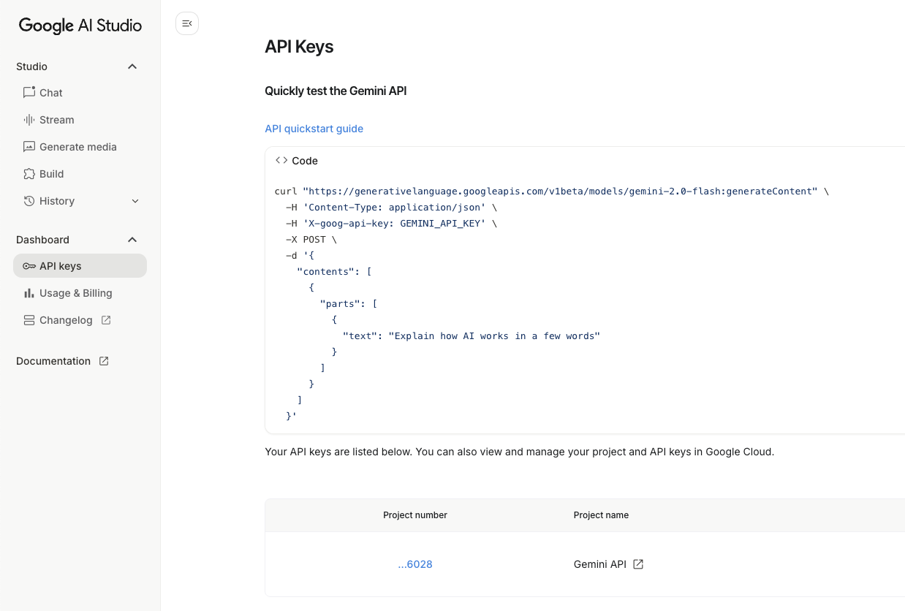

# Interactive Prompting

**Interactive prompting** is the process of refining and optimizing prompts in interactive sessions with a language model, such as Gemini. This approach allows users to iteratively improve their prompts based on the model's responses, leading to more accurate and relevant outputs.

Examples of such interactive environments are [Google AI Studio(Gemini’s playground)](https://aistudio.google.com/prompts/new_chat) or [OpenAI Playground](https://platform.openai.com/chat/edit?mode=chat).

## Google AI Studio
[Google AI Studio](https://aistudio.google.com/prompts/new_chat) is a web-based development environment that helps you experiment with and build applications using Google's generative AI models. It's designed to be user-friendly and provides a lot of features to make the development process smooth.


**Getting Started**

*   **Access Google AI Studio:** You'll typically access it through a web browser. You'll need a Google account to sign in.
*   **Create a New Chat/Project:** Once you're in, you'll usually start by creating a new project or "flow." This is where you'll organize your experiments and models.

**Experiment with prompts**:

*   Text Prompts: e.g. "Help me write a research proposal on AI personalization in brand marketing."
*   Code Prompts: e.g. "Generate a Python code that reads a CSV file and plots a histogram of a specified column."
*   Image Prompts: e.g. "Create an chart based on the following data: [insert data]."

**Experimenting with Models
**
Google AI Studio provides various models you can experiment with, such as:

*   **Generative Models (e.g., Gemini):** These are capable of generating text, code, images, and more based on your prompts.
*   **Chat Models:** Optimized for multi-turn conversations.


In the studio, you'll have an interface where you can:

*   **Select a Model:** Choose the specific AI model you want to use.
*   **Enter Your Prompt:** Type or paste your prompt into the input area.
*   **Adjust Parameters:** You can often tweak parameters like:
    *   **Temperature:** Controls the randomness of the output. Higher temperature means more creative but potentially less coherent results.
    *   **Max output tokens:** Sets a limit on the length of the generated response.
    *   **Top-P / Top-K:** Further control the diversity and quality of the output.
*   **Run the Model:** Execute your prompt and see the generated output.


*   **Iterative Prompting:** The key to getting good results is often an iterative process. You'll try a prompt, see the output, and then refine your prompt based on what you want to change or improve.
*   **Example-Based Learning (Few-shot prompting):** For better control, you can provide the model with examples of the kind of input and output you're looking for. This helps guide the model's behavior. For instance:

    *   **Input:** "Translate 'hello' to Spanish."
    *   **Output:** "Hola."
    *   **Input:** "Translate 'goodbye' to French."
    *   **Output:** "Au revoir."
    *   **Input:** "Translate 'thank you' to German."
    *   **Output:** (Model generates) "Danke schön."


**Example of interactive prompting for image classification**: [Link](https://drive.google.com/file/d/16AKLk8j5vhjccoSeYQTrOijMitDt_V50/view?usp=sharing)

To replicate download the image from here [Link](./../shared_assets/visuals/images/gemini_api1.png)


### Integrating Your Applications

Once you're satisfied with your model's performance in AI Studio, you can usually integrate it into your own applications:

*   **API Keys:** You'll generate an API key from Google Cloud to authenticate your application's requests to the AI models.



*   **Client Libraries:** Google provides client libraries in various programming languages (Python, Node.js, etc.) that make it easy to call the AI models from your code.
We will be using the `google-generative-ai` Python package.

```python
import google.generativeai as genai 
```

### Building app with Gemini

You can also get Gemini help in developing your own applications using
**Build** tab in [Google AI Studio](https://aistudio.google.com/apps). 

Example of the prompt to build an app with Gemini:

```
Build an app that:

Lets me upload files (PDF, DOCX, TXT, CSV, XLSX) and plain text.

Parses tables from CSV/XLSX/PDF and supports light data ops: column selection/rename, filters, group-by, summary stats, simple joins (by exact key), charts on request.

Answers questions grounded in the uploaded files first.

If the answer isn’t in the files, use the Web tool to search, read, and synthesize from reputable sources.

Always return a single, concise answer followed by bullet-point rationale and citations that distinguish file sources vs web sources.

Tools to enable: Files / Google Drive (optional), Web (browsing), Code/Notebook (for table math & quick charts).

Behavioral rules:

Source priority: Prefer uploaded files. Only browse the web when the needed facts or context are missing from the files.

Provenance: After every answer, show:

Sources: with two groups → Files: (filename + page/row range) and Web: (site name + URL).

If you used both, state which parts of the answer came from which source.

Table analysis: If the user asks for analysis, run the calculation (aggregations, trends, correlations) and show a compact table or chart. Describe the method in one sentence.

Citations & quotes: Cite page/row numbers when possible. Short quotes only when necessary.

Uncertainty: If files partially cover the question, say what’s missing and how web sources filled the gap.

Safety & privacy: Never upload user files to external services except the enabled tools. If a request would expose sensitive data, ask before proceeding.

No hidden chain-of-thought: Provide conclusions + brief reasoning, not step-by-step internal logic.

Output schema (use this structure):

{
  "answer": "<concise final answer>",
  "key_points": ["<bullet 1>", "<bullet 2>"],
  "analysis_summary": "<1–3 sentences on method/assumptions>",
  "table_preview": "<markdown table if relevant or omit>",
  "visual": "<embed chart if requested or omit>",
  "next_actions": ["<optional suggestions>"],
  "sources": {
    "files": [{"name":"<file>", "location":"p.5 / rows 120-180"}],
    "web": [{"title":"<page>", "url":"<link>", "note":"<why used>"}]
  }
}


Sample user tasks to validate:

“Summarize Q2 results from the uploaded XLSX and chart revenue by region. If any region is missing, note it.”

“From the policy PDF, what are the retention rules? If not specified, look up Australian legal requirements and compare.”

“Are the supplier names in suppliers.csv on any sanctions lists? If files don’t contain that info, search the web and cite.”

Success criteria:

Answers that can be traced back to sources.

Web is only used when the files don’t contain the answer.

Clean, skimmable output with optional chart and exact citations.
```


**Deploy / Extend**

Once you build or duplicate an app:

- Run it inside AI Studio.

- Export the code (Python, Node.js) to integrate elsewhere.

- Connect to APIs (like Google Maps for Paint A Place).

### Example Use Cases

Google AI Studio provides a collection of small projects and examples to help you get started. They are available in  [Gemini API Cookbook](https://github.com/google-gemini/cookbook), including the code.

Some examples are:

- **Chat with Docs** - Build a chatbot that can answer questions based on the content of your documents. You can upload documents and the model will use them to provide relevant answers. [Link](https://aistudio.google.com/apps/bundled/chat_with_docs?showPreview=true&showAssistant=true)

- **Video Analyzer ** : Explore events within videos using Gemini. [Live demo](https://aistudio.google.com/app/starter-apps/video)

- **3D Spatial understanding** - Use Gemini 3D spatial abilities to understand 3D scenes [Live demo](https://aistudio.google.com/app/starter-apps/spatial) [Code](https://github.com/google-gemini/starter-applets/blob/main/spatial)

- **Code Assistant** - An interactive coding assistant that can help you write, debug, and understand code. You can ask questions about programming concepts, get code snippets, and more. [Link](https://aistudio.google.com


Here are some things you can do with Google AI Studio:

*   **Content Generation:** Write articles, stories, marketing copy, social media posts.
*   **Code Generation:** Generate code snippets, complete functions, or even entire programs.
*   **Chatbots:** Build conversational AI agents for customer support, personal assistants, or entertainment.
*   **Data Summarization:** Condense long documents or articles into key points.
*   **Translation:** Translate text between different languages.
*   **Image Generation:** Create images from text descriptions. 

-------

*Next*: Gemini API in Google Colab [Link](./gemini_api.md)