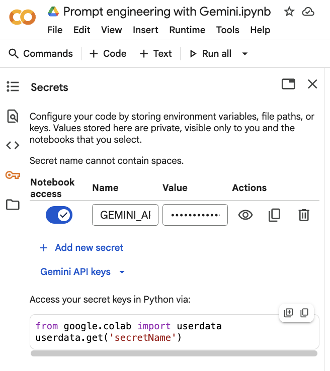

# Prompt Engineering for Large Language Models (LLMs) with Gemini

## Principles of Prompt Engineering

### The Core Problem with "Vanilla" Prompts

A pre-trained model has vast knowledge but lacks specific intent. A simple, vague prompt like:
> `"Explain quantum computing."`
...will yield a generic, one-size-fits-all answer. It might be too simple for an expert, too complex for a beginner, or lack the specific focus you need.

**Prompt engineering solves this by adding context, constraints, and clarity to your instructions.**

---

### Ways to improve model responses

### Structure of the prompt

### Prompting strategies

Good questions get good answers. Poorly worded questions get poor answers.

*why this works and how to do it*

list of strategies and illustrations

## Experiment tracking and documenting

## Evaluation

----------

# Gemini

https://www.promptingguide.ai/models/gemini

# OpenAI

## Interactive Prompting in Google AI Studio and OpenAI playground

## Example of prompt engineering for image classification

Image: 

https://drive.google.com/file/d/16AKLk8j5vhjccoSeYQTrOijMitDt_V50/view?usp=sharing, https://aistudio.google.com/app/prompts?state=%7B%22ids%22:%5B%221StkuPzsZULO_ZJK3ogsSiAaLMq1fWVHJ%22%5D,%22action%22:%22open%22,%22userId%22:%22118442671775108680915%22,%22resourceKeys%22:%7B%7D%7D&usp=sharing, https://drive.google.com/file/d/1de-8_P6pm8Qaf6OjQPnJ2K3QILCxK2EO/view?usp=sharing, https://drive.google.com/file/d/1kb6BzV4go3oftnVHdLtNiqvfPw75mX19/view?usp=sharing, https://drive.google.com/file/d/1qzhHRY39tAHZCb5UZ27P7XIq3M0eUCi7/view?usp=sharing, https://drive.google.com/file/d/1wguihiBjsfCAarM-Okkx-agR61IBeuTZ/view?usp=sharing, https://drive.google.com/file/d/1yMc4n0koIWupW7XT05QWTgQWYoT_Wy8F/view?usp=sharing

## Prompting in Python

### Setting up your API key

###