## Workflow for Image-Based Deep Learning Tasks

When working with images in deep learning, the process usually follows a **three-layer workflow**. Each layer frames a different aspect of the task: preparing the data, selecting and training a model, and evaluating results. This structure ensures that when we later look at specific tasks—such as classification, detection, or captioning—you already understand how the parts fit together.

```mermaid
flowchart LR
    subgraph DataLayer[Data Layer]
        A1[Dataset Choice<br/> ImageNet, COCO, etc.]
        A2[Resizing & Normalization]
        A3[Augmentation]
    end

    subgraph ModelLayer[Model Layer]
        B1[CNNs vs ViTs]
        B2[Transfer Learning]
        B3[Task-specific Models<br/> ResNet, ViT, YOLO, BLIP]
    end

    subgraph EvalLayer[Evaluation Layer]
        C1[Classification<br/> Accuracy, F1, Top-k]
        C2[Detection<br/> mAP]
        C3[Captioning<br/>BLEU, CIDEr, ROUGE]
        C4[Video<br/>Top-k, Temporal Consistency]
    end

    DataLayer --> ModelLayer --> EvalLayer

    class A1,A2,A3 data
    class B1,B2,B3 model
    class C1,C2,C3,C4 eval
    classDef data fill:#cce5ff,stroke:#000,color:#000;
    classDef model fill:#d5f5d5,stroke:#000,color:#000;
    classDef eval fill:#fff3cd,stroke:#000,color:#000;
```

---

### 1. Data Layer – Preparing and Preprocessing Images

The **data layer** is about turning raw images into a form that models can learn from. Key considerations include:

* **Dataset Choice** – For social science research, dataset selection is not just about size, but also about **cultural context, demographic coverage, and ethics**. Public datasets like ImageNet, COCO, or domain-specific collections can be starting points, but custom datasets may be needed for specific applications.
* **Resizing and Cropping** – Images come in many shapes and sizes. Models expect a consistent input (e.g., 224×224 pixels). Random crops or flips during training also act as augmentation to improve generalization. 
* **Normalization** – Pixel values are scaled (e.g., 0–255 → 0–1, or normalized to ImageNet means and stds) to stabilize training and match pretrained model expectations. 
* **Augmentation** – Techniques like rotation, color jitter, or cutout increase data diversity, reducing overfitting. 
* **Batching** – Images are grouped into batches (e.g., 32 or 64) for efficient GPU processing. Care should be taken to ensure batches are representative of the overall dataset, especially in cases of class imbalance.

---

### 2. Model Layer – Architectures and Selection

The **model layer** focuses on choosing the right architecture and adapting it to your data.

* **Classical CNNs vs Vision Transformers (ViTs)** – CNNs bring strong inductive biases (good for small data), while ViTs rely on large pretraining (scalable, flexible, strong global reasoning).

* **Transfer Learning** – Pretrained models (e.g., ResNet, ViT, CLIP) are often fine-tuned on domain-specific datasets, saving compute and improving performance.

* **Task Alignment** –

  * Classification → ResNet, ViT
  * Detection → YOLO, Faster R-CNN, DETR
  * Captioning/Multimodal → BLIP, CLIP, multimodal transformers
* **Practical Considerations** – Balance accuracy, interpretability, compute cost, and dataset size.

---

### 3. Evaluation Layer – Measuring and Interpreting Results

The **evaluation layer** ensures models are not just trained, but also assessed meaningfully.

* **Core Metrics** –

| Task            | Common Metrics                          | Purpose                                      |
|-----------------|-----------------------------------------|----------------------------------------------|
| Classification  | Accuracy, F1, Top-k                    | Measure correct label predictions            |
| Detection       | mAP (mean Average Precision)           | Evaluate bounding box and class accuracy   |
| Captioning      | BLEU, CIDEr, ROUGE, METEOR, BERTScore | Assess quality of generated text            |
| Video           | Top-k, Temporal Consistency                     | Evaluate action recognition and coherence   |

* **Visualization** – Tools like Grad-CAM (highlighting influential pixels), bounding-box overlays, or attention maps provide interpretability.
* **Social Science Fit** – Evaluation should consider not just accuracy but also **bias, fairness, and representational validity**, especially when working with images of people, culture, or sensitive contexts.

---

### Why This Matters

Thinking in terms of **Data → Model → Evaluation** provides a clear roadmap for tackling any image task. Each layer builds on the previous one, and together they make deep learning not just a technical pipeline, but a **research workflow** that can be adapted across domains.

---
