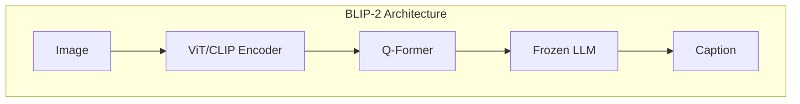
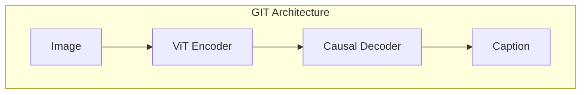

# Image Captioning - Model layer
This section covers the **model layer** for image captioning, focusing on architectures, key innovations, and practical implementations.

### Core families & strong checkpoints on Hugging Face

#### **BLIP / BLIP-2 (Salesforce)**



* **What it is:** Vision encoder (ViT/CLIP) + text decoder; BLIP-2 adds a **Q-Former** to bridge a frozen LLM (OPT/FLAN-T5).
* **Why it matters:** Strong zero/few-shot, robust COCO performance, flexible fine-tuning.
* **Checkpoints:**

  * `Salesforce/blip-image-captioning-base` (fast, great starter)
  * `Salesforce/blip-image-captioning-large`
  * `Salesforce/blip2-opt-2.7b` / `Salesforce/blip2-flan-t5-xxl` (frozen LLM + Q-Former)

#### **GIT — Generative Image-to-Text (Microsoft)**



* **What it is:** ViT vision encoder + causal text decoder; trained at scale on web image–text.
* **Why it matters:** Simple, strong encoder-decoder baseline; competitive on COCO.
* **Checkpoints:** `microsoft/git-base`, `microsoft/git-large`

#### **ViT-GPT2 (VisionEncoderDecoder)**

* **What it is:** Generic **VisionEncoderDecoderModel** (ViT encoder + GPT-2 decoder).
* **Why it matters:** Small, teachable, easy to customize; great for didactics and quick PoCs.
* **Checkpoints:** `nlpconnect/vit-gpt2-image-captioning` (widely used tutorial baseline)

#### **OFA — One For All (OFA-Sys)**

```mermaid
flowchart TD
    subgraph OFA["OFA Architecture"]
        direction LR
        J[Image] --> K[Seq2Seq Model]
        L[Prompt] --> K
        K --> M[Caption]
    end
  ```

* **What it is:** Unified seq2seq (BART-like) across captioning/VQA/grounding with multi-task pretraining.
* **Why it matters:** Strong multi-task transfer; good captioner with the right prompt format.
* **Checkpoints:** `OFA-Sys/ofa-base`, `OFA-Sys/ofa-large`

#### **BEiT-3 (Microsoft)**

* **What it is:** Multimodal masked pretraining unifying vision+language.
* **Why it matters:** Strong encoder for captioning/grounded tasks after fine-tuning.
* **Checkpoints:** `microsoft/beit-3-base`, `microsoft/beit-3-large` (finetune heads for captioning)

#### **Multimodal LLMs usable for captioning (generalists)**

* **Idefics2 (HF M4):** `HuggingFaceM4/idefics2-8b` — multi-image understanding & captioning/chat.
* **LLaVA (vision-chat):** `liuhaotian/llava-v1.6-vicuna-7b` — strong descriptive captions via prompts.
* **Qwen2-VL:** `Qwen/Qwen2-VL-2B-Instruct` (lightweight), `Qwen/Qwen2-VL-7B-Instruct` — good caption quality, long context.
* **mPLUG-Owl2 / InternVL (alt VLMs):** useful when you need OCR-ish or dense descriptions without task-specific heads.

> Document/receipt images: look at **Donut** (`naver-clova-ix/donut-base`) for OCR-style “captioning” of layouts.

---

## Architectural innovations (what moves the needle)

* **Encoder–Decoder vs. Prefixing:** Classic **ViT/ResNet encoder + autoregressive decoder** (GIT, ViT-GPT2) gives controllable generation; CLIP-prefix or **Q-Former** (BLIP-2) efficiently bridges to frozen LLMs for better language priors.
* **Q-Former (BLIP-2):** Learns a small set of visual queries that summarize the image; **frozen LLM stays intact**, making training lighter and generalization strong.
* **Web-scale pretraining:** CC3M/12M, LAION, SBU drive vocabulary/rarity coverage; essential for **NoCaps**-style open-vocab.
* **Detection-augmented features:** Earlier SOTA (VinVL) fed **region features** (Faster R-CNN) into decoders—still helpful for dense/grounded captions.
* **OCR-aware fusion:** Inject detected text tokens/boxes for **TextCaps**; huge gains when scenes contain readable text.
* **Instruction-tuned VLMs:** LLaVA/Qwen2-VL/Idefics2 improve **descriptiveness & controllability** via prompts (“caption briefly”, “list objects then describe”).
* **Video captioning (brief):** Sample frames + **TimeSformer/X-CLIP** visual backbone + text decoder (or a VLM over frame sets). Same principles, but with temporal attention/pooling.

---

## Short Hugging Face snippets

### 1) **Pipeline quickest path** (BLIP / GIT / ViT-GPT2)

```python
from transformers import pipeline

# Swap model for: "Salesforce/blip-image-captioning-base" or "microsoft/git-base"
pipe = pipeline("image-to-text", model="nlpconnect/vit-gpt2-image-captioning", device_map="auto")
out = pipe("demo.jpg", max_new_tokens=64)
print(out[0]["generated_text"])
```

### 2) **BLIP-2 (Q-Former + frozen LLM)**

```python
from transformers import AutoProcessor, AutoModelForCausalLM
from PIL import Image
import torch

model_id = "Salesforce/blip2-opt-2.7b"
processor = AutoProcessor.from_pretrained(model_id)
model = AutoModelForCausalLM.from_pretrained(model_id, torch_dtype=torch.float16, device_map="auto")

img = Image.open("demo.jpg").convert("RGB")
inputs = processor(images=img, text="Describe this image.", return_tensors="pt").to(model.device)
gen_ids = model.generate(**inputs, max_new_tokens=64)
print(processor.batch_decode(gen_ids, skip_special_tokens=True)[0])
```

### 3) **GIT (ViT encoder + causal decoder)**

```python
from transformers import AutoProcessor, AutoModelForCausalLM
from PIL import Image
import torch

model_id = "microsoft/git-base"
processor = AutoProcessor.from_pretrained(model_id)
model = AutoModelForCausalLM.from_pretrained(model_id, device_map="auto")

img = Image.open("demo.jpg").convert("RGB")
pixel_values = processor(images=img, return_tensors="pt").pixel_values.to(model.device)
gen_ids = model.generate(pixel_values=pixel_values, max_new_tokens=64)
print(processor.batch_decode(gen_ids, skip_special_tokens=True)[0])
```

### 4) **VisionEncoderDecoder (ViT-GPT2) — simple & teachable**

```python
from transformers import VisionEncoderDecoderModel, AutoTokenizer, AutoImageProcessor
from PIL import Image
import torch

mid = "nlpconnect/vit-gpt2-image-captioning"
model = VisionEncoderDecoderModel.from_pretrained(mid).to("cuda")
tokenizer = AutoTokenizer.from_pretrained(mid)
image_processor = AutoImageProcessor.from_pretrained(mid)

img = Image.open("demo.jpg").convert("RGB")
pixel_values = image_processor(img, return_tensors="pt").pixel_values.to("cuda")

gen_ids = model.generate(pixel_values, max_new_tokens=64, num_beams=5)
print(tokenizer.batch_decode(gen_ids, skip_special_tokens=True)[0])
```

### 5) **OFA — unified seq2seq** (caption prompt format)

```python
from transformers import OFATokenizer, OFAModel
from PIL import Image
import torch

mid = "OFA-Sys/ofa-base"
tokenizer = OFATokenizer.from_pretrained(mid)
model = OFAModel.from_pretrained(mid).eval().to("cuda")

img = Image.open("demo.jpg").convert("RGB")
# OFA uses task prompts; for captioning:
prompt = " what does the image describe?"
inputs = tokenizer([prompt], return_tensors="pt").to("cuda")
samples = {"input_ids": inputs.input_ids, "patch_images": model.encode_image(img).unsqueeze(0).to("cuda")}
gen = model.generate(**samples, max_new_tokens=64)
print(tokenizer.decode(gen[0], skip_special_tokens=True))
```

### 6) **VLMs as captioners (Idefics2 / LLaVA / Qwen2-VL)**

```python
from transformers import AutoProcessor, AutoModelForVision2Seq
from PIL import Image
import torch

mid = "HuggingFaceM4/idefics2-8b"  # or "liuhaotian/llava-v1.6-vicuna-7b", "Qwen/Qwen2-VL-2B-Instruct"
processor = AutoProcessor.from_pretrained(mid)
model = AutoModelForVision2Seq.from_pretrained(mid, torch_dtype=torch.float16, device_map="auto")

img = Image.open("demo.jpg").convert("RGB")
prompt = "Provide a concise caption:"
inputs = processor(images=img, text=prompt, return_tensors="pt").to(model.device)
gen = model.generate(**inputs, max_new_tokens=48)
print(processor.batch_decode(gen, skip_special_tokens=True)[0])
```

---

### When to pick what (quick guide)

* **Small GPU / teaching:** `nlpconnect/vit-gpt2-image-captioning`
* **Strong baseline, easy finetune:** `microsoft/git-base` or `Salesforce/blip-image-captioning-base`
* **Best zero-shot / generalization:** `Salesforce/blip2-*` (Q-Former + frozen LLM)
* **Multi-task (caption + VQA):** `OFA-Sys/ofa-*`
* **Instructional control / chatty captions:** `Qwen2-VL`, `Idefics2`, `LLaVA`
* **OCR-heavy scenes:** BLIP-2 + OCR tokens or Donut-style models

