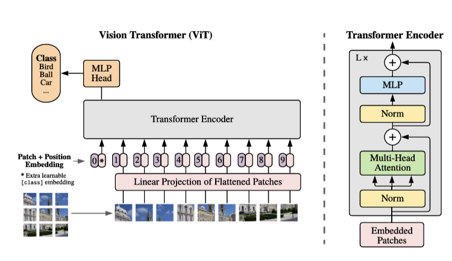
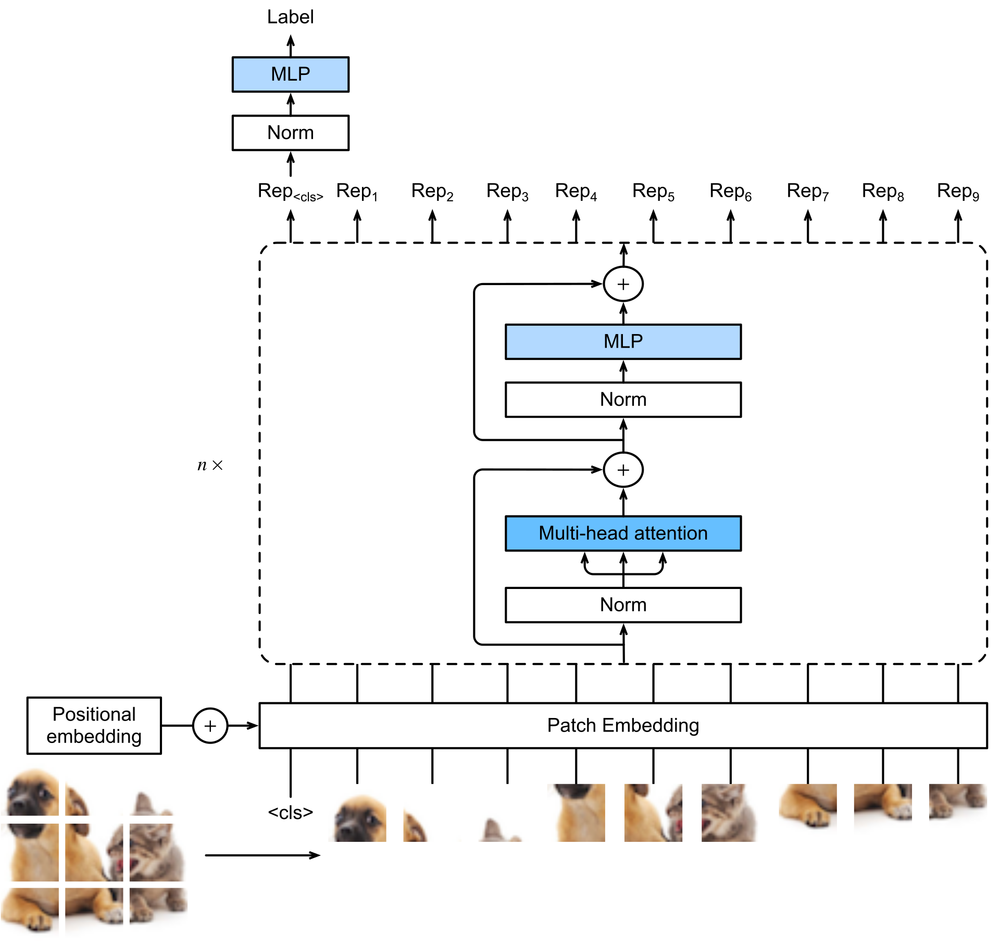

### What is Vision Transformer (ViT)?

**ViT**, or Vision Transformer, is a model architecture introduced in 2020 that adapts the Transformer model—originally designed for natural language processing (NLP)—to computer vision tasks like image classification. It treats an image as a sequence of fixed-size patches, similar to how Transformers process sequences of words, and uses self-attention mechanisms to capture relationships across the entire image.

### How ViT Differs from the Classic Transformer
The classic Transformer, as introduced in the 2017 paper "Attention is All You Need," is primarily built for sequence-to-sequence tasks in NLP, such as machine translation. It consists of an encoder-decoder structure with multi-head self-attention, positional encodings, and feed-forward networks to handle variable-length sequences of tokens (e.g., words or subwords). In contrast, ViT focuses on image data and typically uses only the encoder part for tasks like classification, without a decoder for generation. 

Key differences include:

- **Input Processing**: 

  - In classic **Transformers**, the input pipeline is text-focused: sequences of tokens (words, subwords, or characters) are mapped into continuous vector embeddings that the model processes. 
  
  - **Vision Transformers** (ViT) adapt this idea for images by cutting each image into fixed-size, non-overlapping patches (commonly 16×16 pixels). Each patch is flattened into a 1D vector and then passed through a linear projection to form a patch embedding of the same dimensionality as text tokens in NLP. To enable classification, ViT prepends a learnable “class token” (CLS) to the sequence of patch embeddings, which aggregates information across all patches during self-attention. This adaptation allows an image to be treated like a sequence of tokens, making the Transformer architecture directly applicable to visual tasks.

  
  
- **Positional Encoding**: 

  Both classic Transformers and Vision Transformers (ViT) rely on positional encodings to retain information about order, but they apply them differently. 
  
  - In **text models**, 1D (one-dimensional) positional encodings are added to each token in a linear sequence to signal word order. 
  
  - **ViT** adapts the same idea by flattening an image into a sequence of fixed-size patches and then applying 1D positional encodings to these patch embeddings. The limitation is that 1D encodings don’t fully capture the 2D spatial layout of images. To address this, newer ViT variants introduce 2D-aware positional embeddings (e.g., separate encodings for horizontal and vertical positions or relative positional schemes), allowing the model to better preserve the inherent structure of visual data.

- **Attention Mechanism**: The core self-attention is similar, allowing global interactions between elements. However, in classic Transformers, attention operates on textual semantics, while in ViT, it captures visual relationships across patches, enabling better handling of long-range dependencies without the locality bias of convolutions.

- **Inductive Biases and Efficiency**: 
  - An **inductive bias** is a built-in assumption about the structure of data that helps a model learn faster with less data.

  - **Transformers** don’t hard-code linguistic assumptions. They treat input tokens as a sequence and rely on attention to learn dependencies. This “minimal inductive bias” makes them very flexible, but it means they need large amounts of text data to learn grammar, semantics, etc., rather than having structure baked in.
  
  - **Vision Transformers (ViT)** inherit this property: they don’t naturally encode the spatial hierarchies that CNNs capture through convolution. As a result, ViTs generally require large-scale pretraining (on massive datasets like JFT-300M) to reach strong performance. While this makes them less data-efficient than CNNs on smaller datasets, ViTs are highly parameter-efficient when scaling up, and once trained on enough data, they often surpass CNNs in accuracy and flexibility. This trade-off highlights why ViTs excel in high-data regimes but struggle when data is scarce.

  > **Example**: An example of inductive bias in images is how CNNs assume that nearby pixels are related. This means the model is built to look for small local patterns, like edges or corners, before combining them into bigger shapes and objects. Because of this built-in assumption, CNNs can learn useful features from fewer images, while models without such bias (like ViTs) need much more data to figure out these relationships on their own.

- **Output Handling**:

  - In **ViT**, the output for classification tasks is handled by a special **CLS token**: after the final Transformer layer, the CLS token’s embedding is passed into a small multilayer perceptron (MLP) head to produce the prediction. 
  
  - This is simpler than classic **Transformers** in NLP, which often include a decoder to generate sequences token by token. ViT omits the decoder entirely in its base form, since image classification is not a sequence generation task. 
  
  :::callout-important
  Overall, this highlights ViT’s paradigm shift: it applies pure attention-based processing to vision inputs, avoiding convolutions and enabling more flexible, global feature extraction across the entire image.
  :::

----

### Basic Components of ViT

1. **Image Patch Embedding**:
   - **Function**: Converts an input image into a sequence of fixed-size patches, transforming them into a format suitable for the Transformer.
   - **Details**: The image (e.g., 224x224 pixels) is split into non-overlapping patches (e.g., 16x16 pixels). Each patch is flattened into a vector and passed through a linear projection layer to create patch embeddings of a fixed dimension (e.g., 768). A learnable class token (CLS) is often prepended to the sequence for classification tasks.

2. **Positional Encoding**:
   - **Function**: Adds spatial information to the patch embeddings, as the Transformer lacks inherent knowledge of patch positions.
   - **Details**: 1D learnable positional embeddings are added to each patch embedding to encode their relative positions in the image. Some variants use 2D-aware embeddings for better spatial awareness.

3. **Transformer Encoder**:
   - **Function**: Processes the sequence of patch embeddings to capture relationships across the entire image.
   - **Details**: Consists of multiple identical layers (e.g., 12 layers in ViT-Base), each containing:
     - **Multi-Head Self-Attention (MHSA)**: Computes attention scores to model interactions between all patches, enabling global context understanding.
     - **Feed-Forward Network (FFN)**: A two-layer MLP applied independently to each patch embedding for additional processing.
     - **Layer Normalization and Residual Connections**: Applied before and after MHSA and FFN to stabilize training and improve gradient flow.

4. **Classification Head**:
   - **Function**: Produces the final output for tasks like image classification.
   - **Details**: The CLS token’s output from the final Transformer layer is fed into a small MLP (often a single linear layer) to predict class probabilities. For non-classification tasks, patch outputs can be used directly.

### How ViT Works Conceptually
ViT reimagines an image as a sequence, akin to words in a sentence, and uses the Transformer’s self-attention mechanism to process it holistically. Here’s a step-by-step conceptual overview:

1. **Image as a Sequence**:
   - An image is divided into a grid of patches (e.g., a 224x224 image with 16x16 patches yields 196 patches). Each patch is treated as a "token," similar to a word in NLP. These patches are flattened and projected into a high-dimensional embedding space, creating a sequence of vectors. The CLS token, if used, acts as a summary token for the entire image.

2. **Encoding Spatial Information**:
   - Since the Transformer doesn’t inherently understand the spatial arrangement of patches, positional embeddings are added to each patch’s vector. This ensures the model knows where each patch is located in the original image, preserving some structural information.

3. **Global Attention**:
   - The Transformer encoder processes the patch sequence using self-attention, which allows each patch to "attend" to all other patches, capturing both local and long-range dependencies. For example, a patch containing part of a dog’s ear can relate to a patch of its tail, enabling holistic reasoning about the image. This is a key departure from CNNs, which rely on local receptive fields.

4. **Layer-by-Layer Processing**:
   - Each Transformer layer refines the patch embeddings. Self-attention aggregates information across patches, while the feed-forward network processes each patch independently to add non-linear transformations. Residual connections and normalization ensure stable training. Over multiple layers, the model builds a rich representation of the image.

5. **Output Generation**:
   - For classification, the CLS token’s final representation is extracted and passed through the MLP head to produce class probabilities. The CLS token effectively aggregates information from all patches, acting as a global image descriptor. For other tasks (e.g., segmentation), patch outputs can be used directly or further processed.

### Conceptual Intuition
Think of ViT as reading an image like a book, where each patch is a word, and the Transformer "reads" all words simultaneously to understand the whole story (the image). Unlike CNNs, which focus on local details (like reading one sentence at a time), ViT’s self-attention considers the entire image at once, making it powerful for tasks requiring global context. However, it needs large datasets to learn effectively, as it lacks the built-in locality bias of CNNs.

This approach allows ViT to scale well with data and compute, often surpassing CNNs when pretrained on massive datasets (e.g., JFT-300M), but it may underperform on smaller datasets without sufficient pretraining.