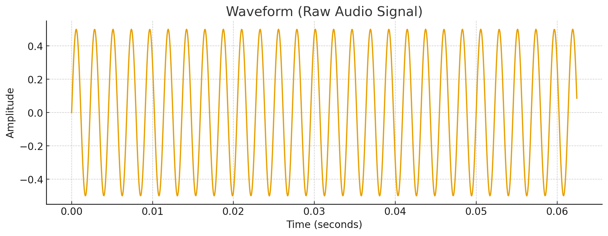
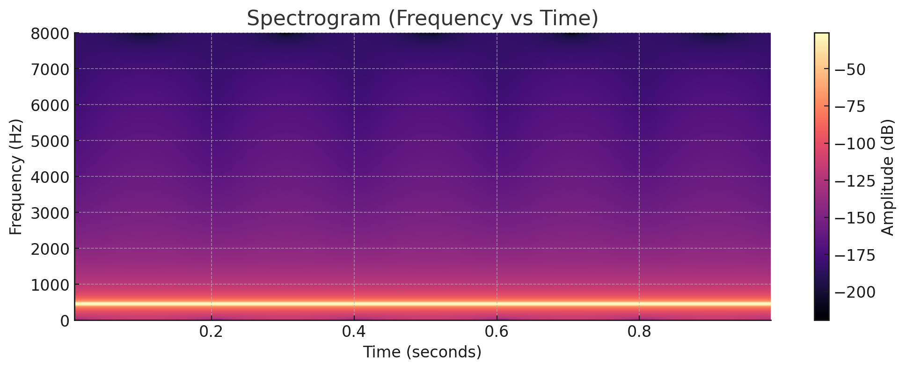

# Introduction to Audio in Deep Learning

# Working with Audio Data in Deep Learning

Audio is a powerful and versatile information source with growing importance across industries and research. Deep learning has transformed audio processing, enabling machines to understand, interpret, and generate sound with remarkable accuracy.

---

### Motivation Example

Imagine a brand monitoring TikTok or Instagram Reels. The video is not just *visuals*: the **tone of voice, background music, and emotional cadence** reveal as much about audience engagement as the images do. A flat caption like *“I love this bag”* carries very different meaning when spoken with excitement, sarcasm, or frustration. Capturing that nuance requires **listening to the sound as much as looking at the image** — a challenge perfectly suited to deep learning methods.

---

### Industry Applications

* **Customer Experience & Brand Monitoring**: Detecting satisfaction, frustration, or emerging memes from call center recordings and social media.
* **Virtual Assistants & Accessibility**: Speech recognition and multimodal assistants (e.g., Siri, Alexa, GPT-4o) that rely on both *what* is said and *how*.
* **Content Creation & Moderation**: Auto-captioning, harmful content filtering, and personalized audio-visual recommendations.
* **Healthcare & Wellbeing**: Emotion-aware systems that support mental health interventions or detect stress from voice patterns.

---

### Social Sciences Research Cases

* **Emotion & Identity**: How tone, rhythm, and emphasis express belonging or resistance in sociolinguistics and psychology.
* **Cultural Dynamics Online**: Studying meme evolution in audio-visual remix culture (music overlays, voice filters, lip-syncs).
* **Political & Crisis Communication**: Measuring public sentiment during debates, protests, or crises by combining speech, images, and text.

---

### Key Applications of Audio in Deep Learning

1. **Speech Recognition**: Converting spoken language into text (e.g., transcription, real-time translation).
2. **Music Generation & Recommendation**: Creating new music or tailoring playlists with generative models.
3. **Audio Classification**: Identifying sound categories (environmental sounds, genres, speakers).
4. **Emotion Recognition**: Detecting emotions from vocal tone and speech patterns.
5. **Noise Reduction & Enhancement**: Improving clarity for telecommunication and hearing aids.

---

### Applications in Social Sciences & Brand Research

* **Emotion and Identity Expression**: Analyzing tone, rhythm, and vocal style to understand how individuals signal belonging, resistance, or status in everyday interactions.
* **Cultural Dynamics in Online Platforms**: Tracking how audio elements (music overlays, voice filters, speech patterns) shape meme culture, trends, and collective identities on TikTok, Instagram, and YouTube.
* **Psychological Wellbeing and Mental Health**: Using vocal cues to study stress, anxiety, or mood shifts, offering insights into lived experience and communication patterns.
* **Brand and Consumer Engagement**: Assessing how consumers speak about products — excitement, irony, hesitation — to reveal deeper attitudes than text alone.
* **Collective Behavior and Social Movements**: Examining chants, speeches, or protest recordings to understand how shared voice patterns reinforce solidarity or mobilization.

---

### What Is Audio Data?

Audio is a sound signal represented in different ways:

* **Waveforms** → raw amplitude over time.
* **Spectrograms** → frequency-time heatmaps.
* **MFCCs (Mel-Frequency Cepstral Coefficients)** → compact features capturing perceptual aspects of sound.

When with audio, the key decision is how to represent the sound before feeding it into the model. Two main approaches are used: **waveforms** and **spectrograms**. Both are valid, and each has its own strengths.

---

#### 1. Waveform Path

A **waveform** is the raw signal — amplitude plotted over time. At a given sampling rate (for example, 16,000 samples per second), the waveform is a direct record of how the sound vibrates.

* **How it works in transformers**: The raw waveform is first passed through a small convolutional feature extractor that chunks the signal into frames. These frames become tokens for the transformer.
* **Example**: **Wav2Vec 2.0** learns powerful speech representations directly from raw audio, without relying on handcrafted features.
* **Why it matters**: This path preserves the original richness of the sound and adapts well to noisy, multilingual, or real-world data.

---

### 2. Spectrogram Path

A **spectrogram** is a time–frequency map — it shows how energy is distributed across frequencies as the audio unfolds. Time runs along one axis, frequency along the other, and color intensity indicates amplitude.

* **How it works in transformers**: The spectrogram is treated like an image. It is divided into patches, and each patch is embedded before being passed to the transformer, just as in a Vision Transformer.
* **Example**: The **Audio Spectrogram Transformer (AST)** applies the ViT logic directly to spectrogram patches, achieving strong results in sound classification tasks.
* **Why it matters**: This path is visually interpretable (patterns can be seen in the spectrogram) and transfers well from computer vision methods.

---

> *Hint:* Choosing Between Them

> * **Waveforms**: Best when aiming for general-purpose representations and robustness to noise.
> * **Spectrograms**: Best when interpretability or visual transfer from ViTs is an advantage.

> In practice, many state-of-the-art models experiment with both approaches. The important point is that the **model backbone remains the same** — only the way audio is tokenized differs.

---

#### A Note on MFCCs
**MFCCs** are a traditional way of representing audio before deep learning became dominant. They are compact numerical features that summarize how humans perceive sound.

**Mel scale**: Frequencies are warped to match how the human ear hears — we are more sensitive to some ranges than others.

**Cepstral coefficients**: Capture the overall shape of the sound spectrum in a small set of numbers.

**Why it matters**: MFCCs were widely used in speech recognition and emotion detection because they reduce raw audio into features that highlight perceptual qualities. While modern transformers often work directly on waveforms or spectrograms, MFCCs remain a useful baseline and are still used in many practical systems.
---

### How Deep Learning Works with Audio Data

Deep learning processes audio by converting raw signals into representations (spectrograms, MFCCs) that capture essential features. Architectures include:

* **CNNs**: Extract local features from spectrograms (useful for classification, recognition).
* **RNNs/LSTMs**: Model temporal dependencies in sequential audio.
* **Transformers**: Capture long-range dependencies efficiently, now state-of-the-art.

**Popular models**:

* **Wav2Vec 2.0** → self-supervised, learns directly from raw audio.
* **HuBERT** → predictive masked modeling for speech.
* **OpenL3** → audio embeddings for retrieval/recommendation.
* **YAMNet** → large-scale sound event classification.

--- 
### Bridging from Transformers & ViTs

If you know how transformers work in NLP and computer vision, adapting to audio is straightforward:

* Images split into **patches** → audio split into **frames** or **spectrogram patches**.
* Transformers learn **temporal and frequency patterns** instead of spatial ones.
* Multimodal models align **words, visuals, and sounds** via cross-attention.

This leads to a unified framework: the same transformer principles now power text, vision, and audio.

---

Deep learning has unlocked new possibilities for working with audio: from brand monitoring to healthcare and social sciences. By bridging text, vision, and sound under one transformer framework, we are entering a truly **multimodal era** of AI.

---