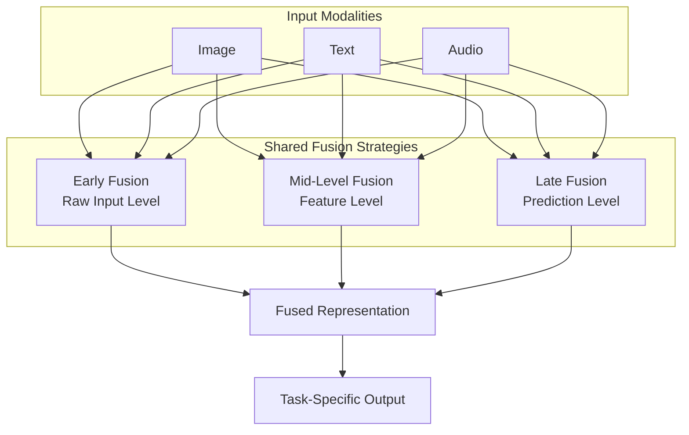

# Towards Multimodal

Audio rarely exists in isolation. In daily life and across digital platforms, it is intrinsically interwoven with text, visuals, and context. A TikTok video is a symphony of music, dialogue, video filters, and on-screen text; a customer support call's meaning is derived from both the transcript and the agent's empathetic tone; a political speech's impact hinges on the words spoken, the passion in the delivery, and the speaker's commanding presence. To capture the full, nuanced richness of human communication, artificial intelligence models must be designed to work across these modalities, learning not just from each stream in parallel, but from their complex interactions.

---

### **The Challenge of Multimodal Learning**

Combining modalities is more complex than simply feeding different data types into a model. The core challenges include:
*   **Temporal Alignment:** A word must be aligned with the mouth movement that produces it and the sound that results. A crash in a video must align with the sound effect.
*   **Semantic Gap:** The raw features of each modality are fundamentally different (pixels vs. audio waveforms vs. token IDs). The model must learn a common language to relate them.
*   **Modality Heterogeneity:** Data streams can have different sampling rates, sequence lengths, and information density. A single image can convey as much meaning as several seconds of audio or a paragraph of text.

### **Fusion Strategies: Architectures for Integration**

There are several key architectural paradigms for bringing different modalities together, each with its own strengths and trade-offs.

* **Early Fusion**
  Raw or lightly processed features from multiple sources (e.g., audio spectrograms treated as images, combined with image patches) are combined at the input stage. The transformer processes this combined input throughout its entire depth.
  *   **Benefit:** Can capture very fine-grained, low-level correlations between modalities (e.g., the precise shape of a mouth for a specific phoneme sound).
  *   **Drawback:** Requires the modalities to be perfectly aligned and synchronous. It can be computationally expensive and noisy if inputs are not well-matched.

* **Late Fusion (a.k.a. Model-Level Fusion)**
  Each modality is processed by a separate, dedicated model (encoder). The outputs of these models (e.g., feature vectors or predictions) are combined only at the very end.
  *   **Benefit:** Highly flexible and modular. Different pre-trained experts can be used for each modality (e.g., a powerful image model and a powerful audio model). Easier to train as modalities don't need to be aligned during training.
  *   **Drawback:** Fundamentally misses the opportunity to learn rich, intermediate interactions between modalities. The model cannot learn that a specific visual cue changes the meaning of a spoken word.

* **Intermediate Fusion (The Hybrid Approach)**
  This is often the most powerful approach. Modalities are processed independently initially, but their encoded representations are merged at several intermediate layers within the model. This allows for complex cross-modal interactions to be learned hierarchically.
  *   **Cross-Attention:** A particularly powerful technique for intermediate fusion. One modality (e.g., text) serves as the "query," and another (e.g., audio) serves as the "key" and "value." This allows the model to dynamically and softly "attend" to the most relevant parts of the audio based on the text, and vice versa. This is the backbone of modern models like **Flamingo**, **GPT-4V**, and **Whisper**.

* **Joint Embeddings**
  This is a specific goal rather than a standalone architecture, often achieved via the methods above. Audio and text (or other modalities) are projected into a shared latent vector space where similar concepts land near each other regardless of their modality. This enables powerful cross-modal retrieval tasks.
  *   **Examples:** **CLAP** (Contrastive Language-Audio Pre-training) embeds text and audio into a shared space, allowing you to search for sounds using text queries. **ImageBind** by Meta aims to create a joint embedding space for six modalities (image, text, audio, depth, thermal, and IMU data).

---

### **Why It Matters: From Theory to Application**

Multimodal transformers represent a significant leap towards AI that perceives the world more like humans do: by synthesizing sight, sound, and language into a coherent understanding. This capability is transformative in areas such as:

*   **Accessibility Technology:** Developing advanced tools for the deaf and hard-of-hearing, such as real-time captioning that conveys not just words but speaker identification and emotional tone.
*   **Content Moderation:** Moving beyond simple text or image filters to understand context. A threatening statement might be a serious comment, a song lyric, or a sarcastic joke depending on the tone of voice and visual context.
*   **AI-Human Interaction:** Building more sophisticated and empathetic virtual assistants and social robots that can understand a user's emotional state from their voice, words, and facial expression to provide a appropriate response.
*   **Scientific Research:** Analyzing complex systems where data is inherently multimodal, such as behavioral neuroscience ( correlating brain imaging, audio recordings of vocalizations, and observed movement) or climate science ( combining satellite imagery, audio from hydrophones, and sensor data).

The future of AI is not just about building larger models, but about building more integrated ones. The true frontier lies in creating architectures that can seamlessly reason across the full spectrum of human experience, unlocking a deeper and more contextual understanding of our world.